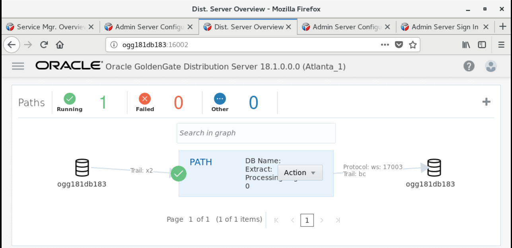

Update August 7, 2018

## Working with REST API
## Introduction

In this lab, you will take a look at how to pull a list of services from Oracle GoldenGate using the REST APIs (Curl Commands). Replace <port> with the port number of the service you want to access.

Steps:
1. Open a command window (right mouse click – Open Terminal)

2. Create a json file for building an integrated   extract .

3. Start the change-capture extract using the Curl Command, which would start the extract with begin-now option.

4. After the command is executed successfully, the command output looks like this:

5. On the Goldengate Microservices Console, under the Admin Server you can see the Extract has been started and running .

6. A path needs to be  created to send the transaction of data from the Extract to the Replicat. You can create a new path by adding configuration  in JSON file.

7. You can execute the following curl command to add the PATH to send data from Extract to replicat.

8. Once the command is executed successfully, you can check on Goldengate Microservices Web Console under Distribution Server for the PATH created  and its Running Status.

9.Next Step is to configure replicat on target which can be done by specifying the various configuration parameters for the Replicat in a JSON file as shown below:

10. In this Step, You just need to configure and create the Replicat and do not start it. Using the curl command we can add the replicat.

Try running the following CURL command.
curl -u oggadmin:welcome1 -H "Content-Type: application/json" -H "Accept:
application/json" -X GET
http://localhost:<port>/services/v2/deployments/SanFran_1/services/distsrvr/logs |
python -mjson.tool

3. Retrieve Log locations using the following CURL command
curl -u oggadmin:welcome1 -H "Content-Type:application/json" -H
"Accept:application/json" -X GET http://localhost:<port>/services/v2/logs | python - mjson.tool

Appendix:

A: Run Swingbench
Steps:
1. Open a command terminal and navigate to the Swingbench bin directory (Figure A-1)
$ cd /opt/app/oracle/product/swingbench/bin

2. Execute the swingbench command (Figure A-2)
$ ./swingbench

3. Once Swingbench starts, select the SOE_Server_Side_V2 configuration file.

4. Once Swingbench is open, update the Password, Connect String, and Benchmark Run
Time (Figure A-4)
Password: welcome1
Connect String: //ogg123rs/pdb1
Benchmark Run Time: 10 mins

5. Execute Swingbench (Figure A-5)

At this point you should see activity on the table by looking at the Extract/Replicats.
Correct any problems that may arise due.

At this point, you should have a fully functional REST Api environment. 